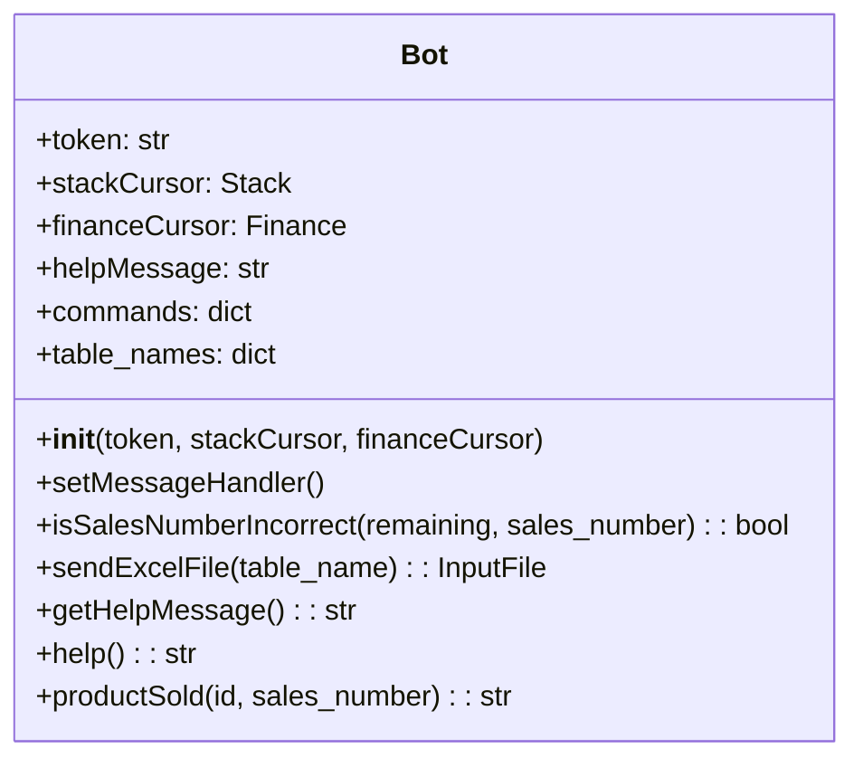
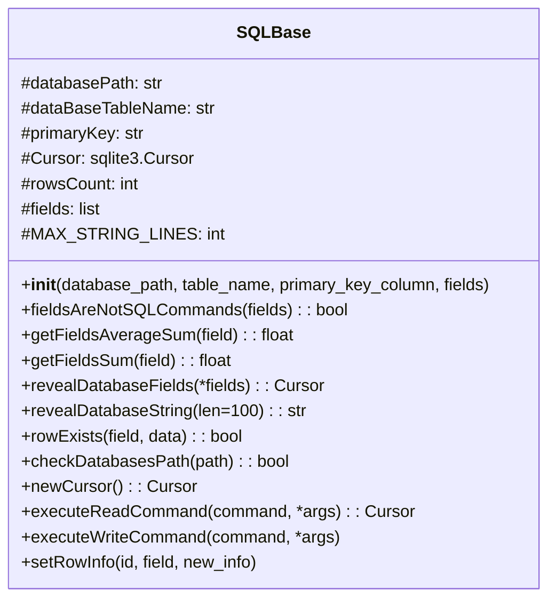
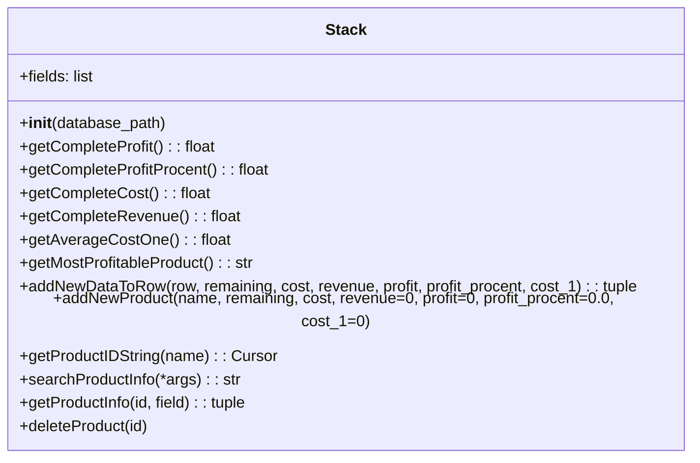
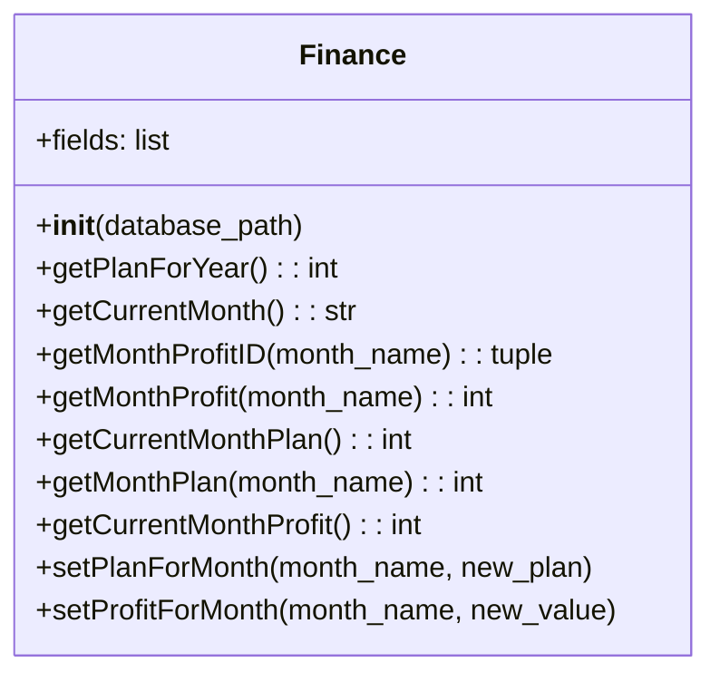
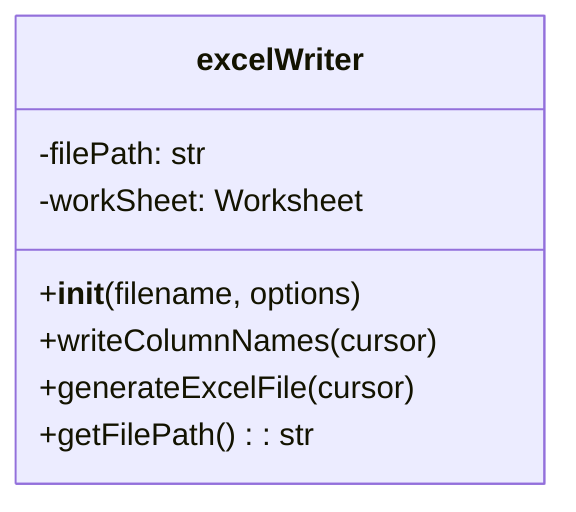
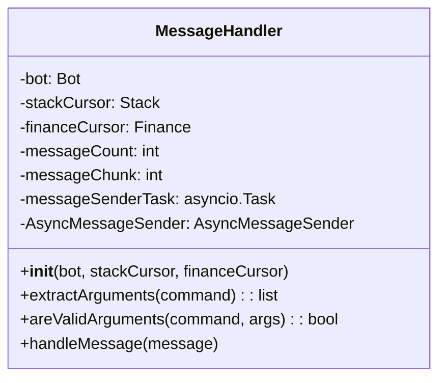
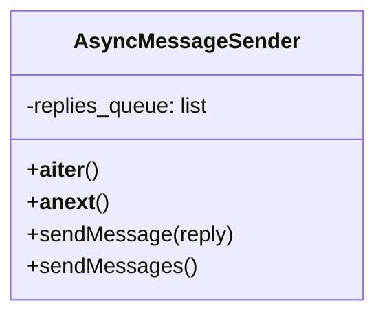
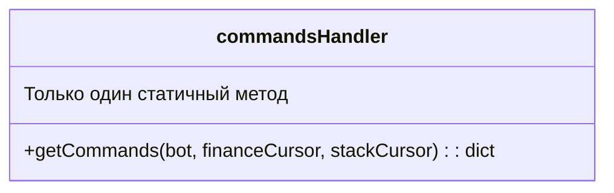
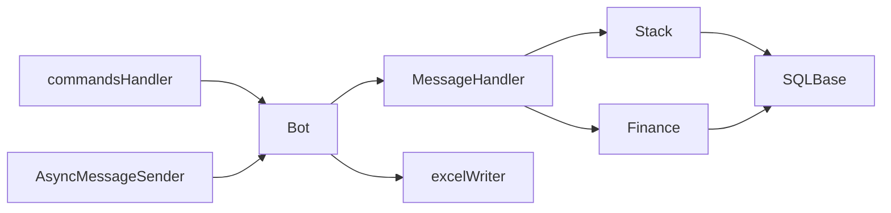

# Структура классов

## 1. Класс `Bot` (FinanceBot.py)

## 2. Класс `SQLBase` (Database.py)

## 3. Класс `Stack` (Stack.py)

## 4. Класс `Finance` (Finance.py)

## 5. Класс `excelWriter` (ExcelWriter.py)

## 6. Класс `MessageHandler` (FinanceBot.py)

## 7. Класс `AsyncMessageSender` (FinanceBot.py)

## 8. Обработчик команд `commandsHandler` (commands.py)

## 🔗 Связи между классами

## 📌 Пояснения:
1. **Bot**: Центральный класс, обрабатывающий Telegram API
2. **SQLBase**: Базовый класс для работы с SQLite
3. **Stack/Finance**: Специализированные наследники SQLBase для предметных областей
4. **excelWriter**: Генератор Excel-отчетов на основе xlsxwriter
5. **MessageHandler**: Обработчик входящих сообщений с валидацией
6. **AsyncMessageSender**: Асинхронная очередь отправки сообщений
7. **commandsHandler**: Конфигуратор доступных команд бота

Каждый метод содержит полный набор параметров и возвращаемых значений в соответствии с исходным кодом. Все связи между классами отражают реальные вызовы методов и использование объектов.