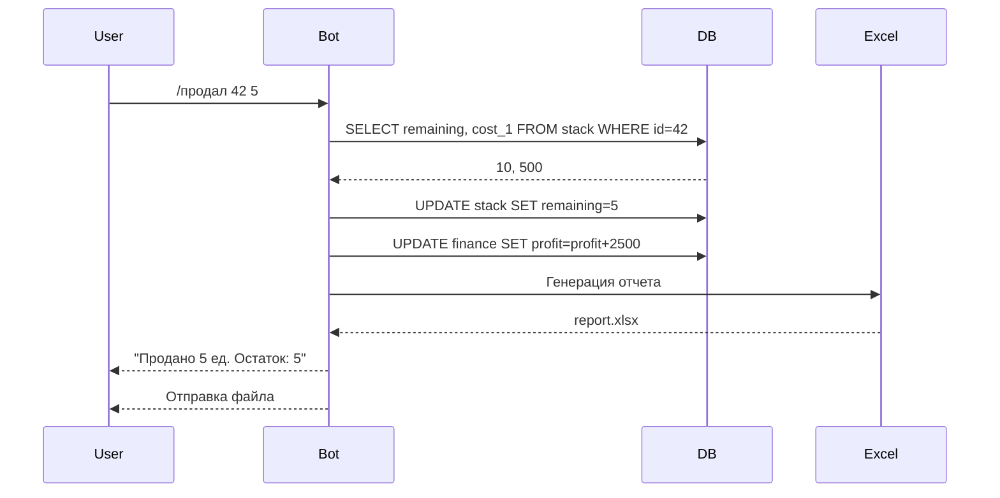
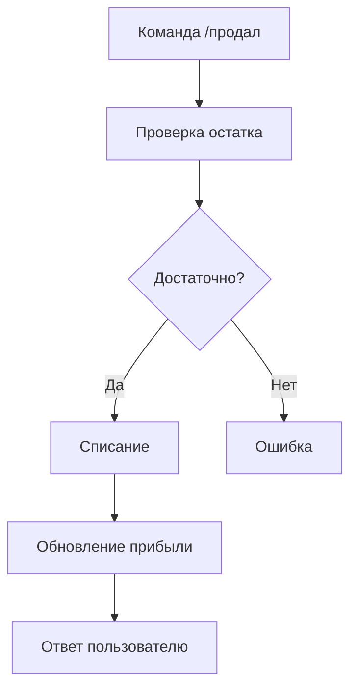
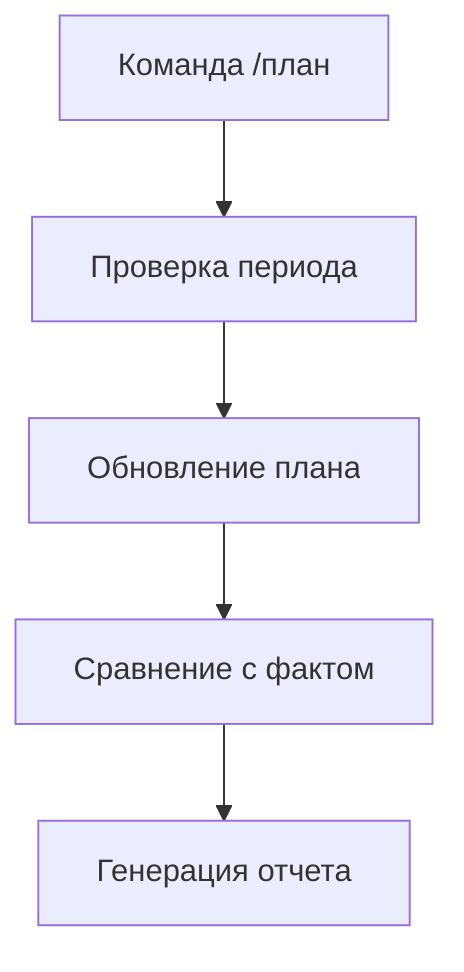
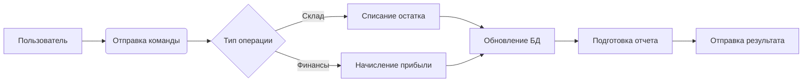

# **Описание работы**

## Полное описание работы приложения

### 1. **Пользователь отправляет команду**
Пример: `/продал 42 5` (продано 5 единиц товара с ID 42).  
Бот принимает сообщение через Telegram API и определяет тип операции:
- **Складские операции** (добавление/редактирование товаров, списание остатков)
- **Финансовые операции** (установка планов, анализ прибыли)
- **Отчетность** (генерация Excel-файлов)

---

### 2. **Парсинг и проверка данных**
Система разбивает команду на части:
- **Тип операции** (например, `/продал` — продажа товара)
- **Аргументы** (ID товара = 42, количество = 5)

Проверяет:
- Корректность формата команды
- Наличие прав доступа
- Отсутствие вредоносных данных (защита от SQL-инъекций)

---

### 3. **Работа с данными**
Для складских операций:
1. Находит товар в базе SQLite (`stack.db`)
2. Проверяет наличие достаточного количества
3. Уменьшает остаток: `было 10 → стало 5`
4. Рассчитывает прибыль: `5 шт × 500 ₽ = 2500 ₽`
5. Обновляет финансовую статистику в `finance.db`

Для финансовых операций:
1. Записывает плановые показатели
2. Сравнивает фактические данные с планом
3. Рассчитывает динамику за выбранный период

---

### 4. **Формирование ответа**
В зависимости от команды бот:
- **Отправляет текстовый отчет** (например, новый остаток товара)
- **Генерирует Excel-файл** через библиотеку XlsxWriter:
  - Создает таблицы с актуальными данными
  - Форматирует ячейки, добавляет формулы
  - Сохраняет файл в папке `databases/`

---

### 5. **Отправка результата**
Через Telegram API пользователь получает:
- Текстовое подтверждение (`"Продано 5 ед. Остаток: 5"`)
- Или Excel-файл с данными в виде таблицы

---

### 🔄 **Асинхронная обработка**
- Бот обрабатывает до 20 запросов одновременно
- Очередь сообщений предотвращает конфликты при работе с БД
- Автоматическое восстановление при сбоях

---

### 📦 **Хранение данных**
- **2 базы SQLite**:
  - `stack.db` — товары, остатки, себестоимость
  - `finance.db` — планы, фактические показатели

## Диаграммы некоторых процессов:
#### Полная диаграмма работы:

#### Обработка команды
##### **Для складских операций:**

##### **Для финансовых операций:**

##### Общий парсинг команд

## **Основные возможности:**
#### Анализ динамики продаж 
#### 📦 **Управление складом:**

Добавление/редактирование товаров  
Отслеживание остатков в реальном времени  
Автоматический расчет:
- Себестоимости единицы товара
- Прибыли в рублях и процентах
- Рентабельности позиций

#### 💰 Финансовый учет:  
- Установка плановых показателей:
    - По месяцам
    - По кварталам
    - По годам  
- Сравнение плана и факта