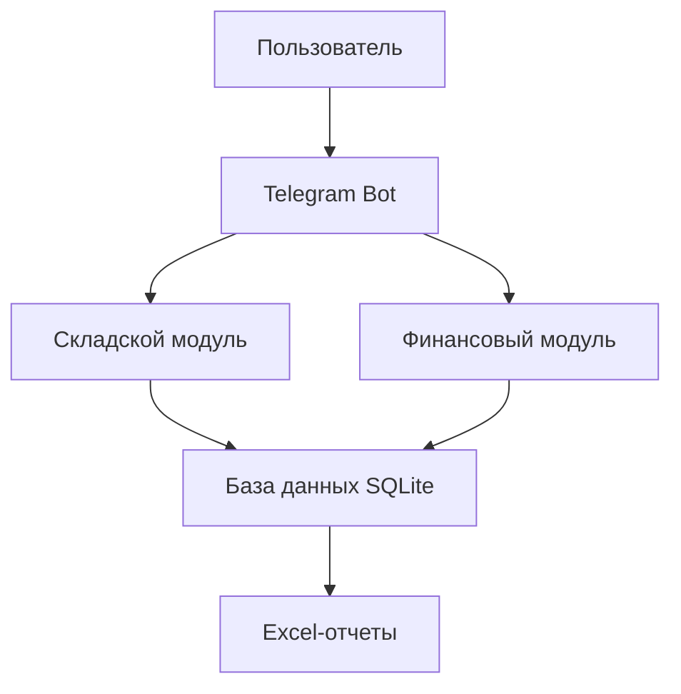
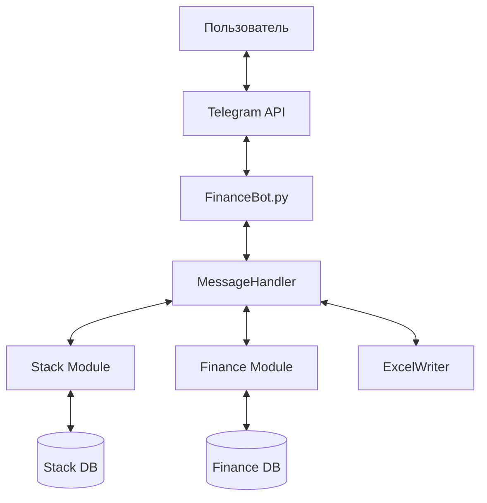
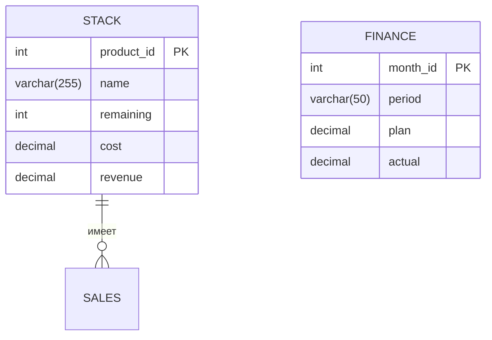
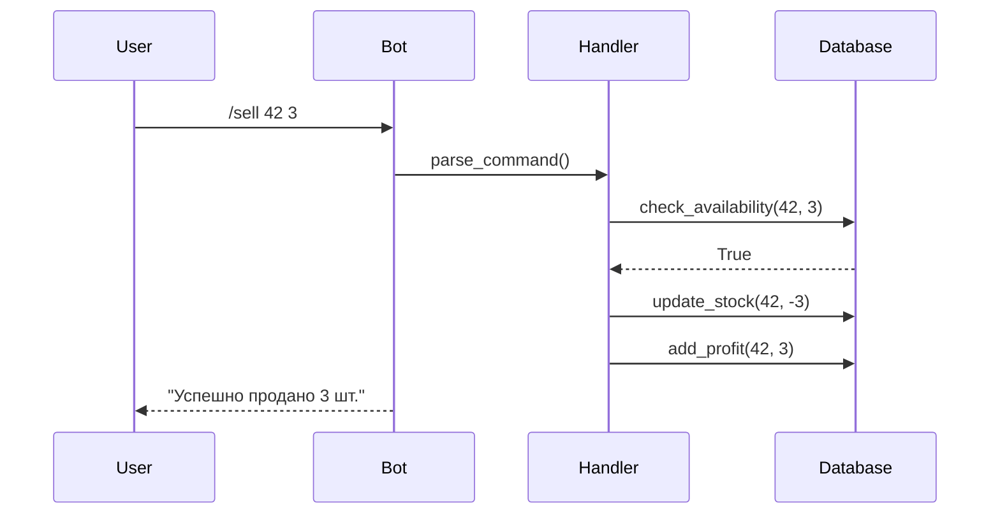

# Техническое руководство
Техническое руководство по разработке Telegram-бота для управления складом и финансами

---

## 🗂️ Оглавление
1. [Введение](#введение)  
2. [Архитектура системы](#архитектура-системы)  
3. [Настройка среды разработки](#️-настройка-среды-разработки)  
4. [Проектирование базы данных](#проектирование-базы-данных)  
5. [Реализация основных модулей](#-реализация-основных-модулей)  
6. [Интеграция с Telegram API](#интеграция-с-telegram-api)  
7. [Тестирование](#-тестирование)  
8. [Деплой](#-деплой)  
---

## Введение
Цель проекта — создать Telegram-бота для автоматизации учета товаров и финансовых операций.  
**Ключевые функции**:  
- Управление складскими остатками  
- Расчет прибыли и рентабельности  
- Генерация отчетов в Excel  
- Планирование и мониторинг финансовых показателей  



## Архитектура системы

### Диаграмма компонентов


## ⚙️ Настройка среды разработки

### Шаг 1: Установка Python и зависимостей
1. Скачайте [Python 3.10+](https://www.python.org/downloads/)
2. Создайте виртуальное окружение:
   ```bash
   python -m venv venv
   source venv/bin/activate  # Linux/Mac
   venv\Scripts\activate.bat  # Windows
   ```
3. Установите библиотеки:
   ```bash
   pip install python-telegram-bot==20.0 sqlite3 xlsxwriter
   ```

### Шаг 2: Настройка проекта
Структура папок:
```
project/
├── bot/
│   ├── handlers/
│   ├── database/
│   └── utils/
├── config.py
└── requirements.txt
```

## Проектирование базы данных

### ER-диаграмма


### SQL-скрипты
1. Создание таблицы `STACK`:
   ```sql
   CREATE TABLE STACK (
       product_id INTEGER PRIMARY KEY AUTOINCREMENT,
       name TEXT NOT NULL,
       remaining INTEGER DEFAULT 0,
       cost DECIMAL(10,2),
       revenue DECIMAL(10,2)
   );
   ```
2. Создание таблицы `FINANCE`:
   ```sql
   CREATE TABLE FINANCE (
       month_id INTEGER PRIMARY KEY AUTOINCREMENT,
       period VARCHAR(50) UNIQUE,
       plan DECIMAL(10,2),
       actual DECIMAL(10,2)
   );
   ```


## 💻 Реализация основных модулей

### 1. Модуль работы с базой данных (database/core.py)
```python
import sqlite3

class Database:
    def __init__(self, db_path: str):
        self.connection = sqlite3.connect(db_path)
        self.cursor = self.connection.cursor()
    
    def execute(self, query: str, params: tuple = None):
        try:
            self.cursor.execute(query, params or ())
            self.connection.commit()
            return self.cursor.fetchall()
        except sqlite3.Error as e:
            print(f"Database error: {e}")
```

### 2. Складской модуль (handlers/stack.py)
**Пример метода для списания товара**:
```python
def sell_product(self, product_id: int, quantity: int) -> bool:
    current = self.db.execute("SELECT remaining FROM STACK WHERE product_id=?", (product_id,))
    if not current or current[0][0] < quantity:
        return False
    
    self.db.execute("UPDATE STACK SET remaining = remaining - ? WHERE product_id=?", (quantity, product_id))
    return True
```

## Интеграция с Telegram API

### Диаграмма последовательности


### Пример обработчика команды (bot/handlers/main.py)
```python
from telegram import Update
from telegram.ext import CommandHandler

def sell_handler(update: Update, context):
    args = context.args
    if len(args) != 2:
        update.message.reply_text("Используйте: /sell <ID> <кол-во>")
        return
    
    product_id = int(args[0])
    quantity = int(args[1])
    
    if stack_manager.sell_product(product_id, quantity):
        update.message.reply_text(f"Продано {quantity} шт. товара {product_id}")
    else:
        update.message.reply_text("Ошибка: недостаточно товара")
```

## 🧪 Тестирование

### Таблица тест-кейсов
| Тест-кейс | Входные данные | Ожидаемый результат | Статус |
|-----------|----------------|---------------------|--------|
| Добавление товара | `/add Book 100 50` | Товар в БД | ✅ |
| Продажа товара | `/sell 1 10` | Остаток уменьшен | ✅ |
| Генерация отчета | `/report stock` | Файл stock.xlsx | ✅ |

### Пример юнит-теста (tests/test_stack.py)
```python
import unittest
from handlers.stack import StackManager

class TestStack(unittest.TestCase):
    def setUp(self):
        self.manager = StackManager(":memory:")
        
    def test_add_product(self):
        self.manager.add_product("Laptop", 10, 1000)
        result = self.manager.get_product(1)
        self.assertEqual(result["name"], "Laptop")
```

## 🚀 Деплой

### Вариант 1: Docker
1. Создайте `Dockerfile`:
   ```dockerfile
   FROM python:3.10-slim
   WORKDIR /app
   COPY . .
   RUN pip install -r requirements.txt
   CMD ["python", "bot/main.py"]
   ```
2. Соберите образ:
   ```bash
   docker build -t finance-bot .
   ```
3. Запустите контейнер:
   ```bash
   docker run -d --name bot -e BOT_TOKEN="ваш_токен" finance-bot
   ```

### Вариант 2: Ручной деплой
```bash
# Настройка переменных окружения
export BOT_TOKEN="ваш_токен"
export DB_PATH="/data/finance.db"

# Запуск
python -m bot.main
```
---

## Заключение
Это руководство предоставляет полный цикл разработки Telegram-бота для управления складом и финансами. Для адаптации под ваши нужды:  
1. Измените структуру БД  
2. Добавьте новые команды обработчиков  
3. Настройте шаблоны отчетов  

---

**Автор**: Zertmark  
**Версия**: 1.0.0  
**Дата**: 16.05.2025  