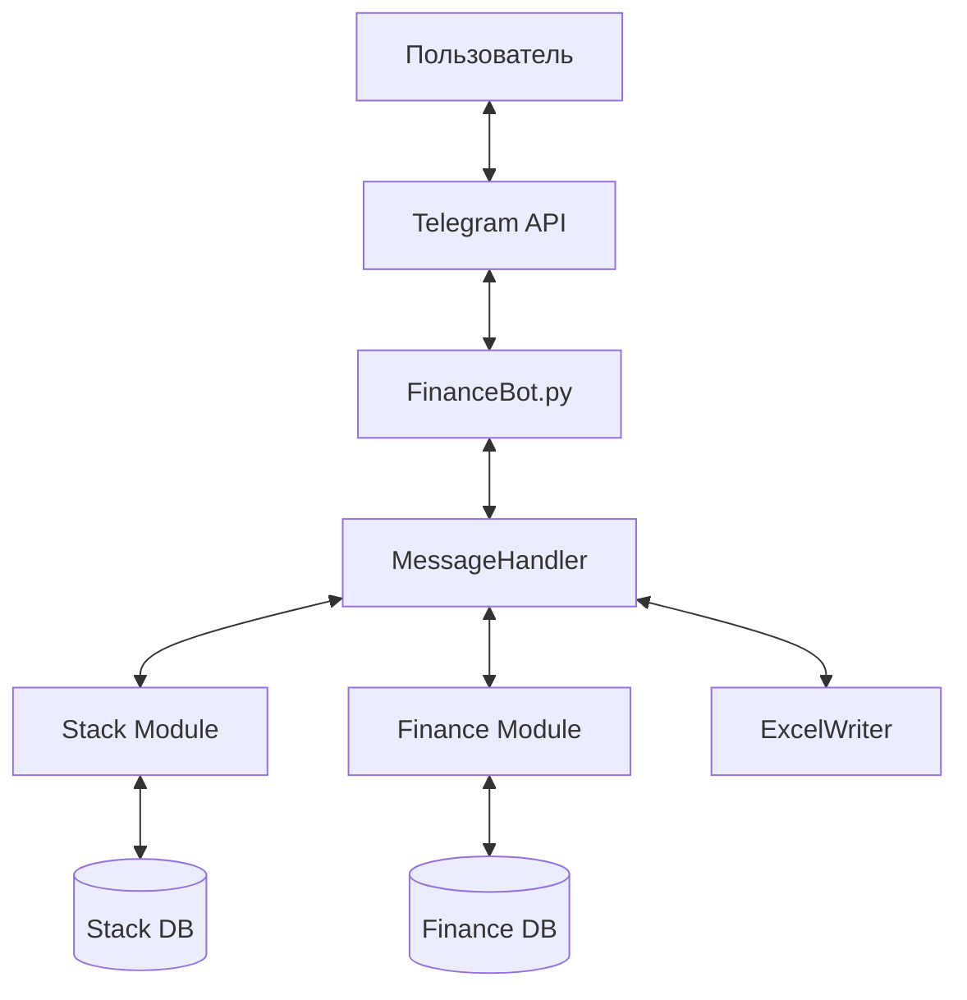
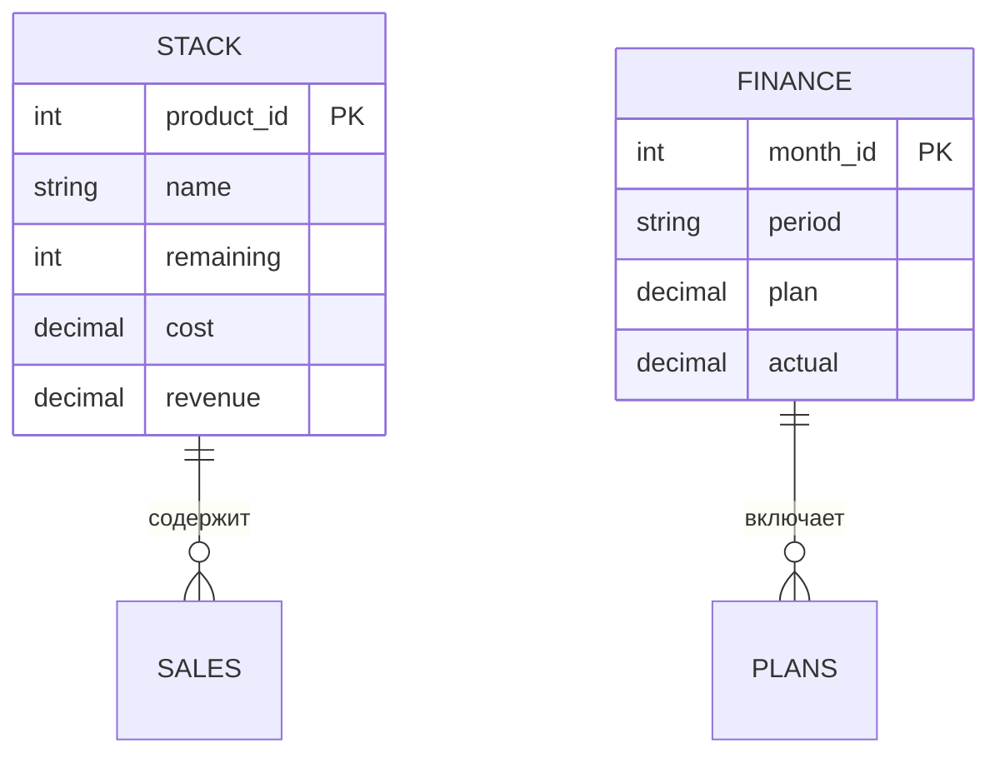

# Структура проекта

## **Структура папок и файлов проекта**
```
├ FinanceBot.py      # Главный скрипт бота
├ databases/
│ ├── finance.db     # Финансовые записи
│ └── stack.db       # Данные склада
├ src/
│ ├── Database.py    # Базовый класс DB
│ ├── Stack.py       # Логика склада
│ ├── Finance.py     # Финансовые операции
│ ├── ExcelWriter.py # Генерация Excel
│ └── commands.py    # Обработчики команд
```

## 🌐 Архитектура приложения


## 🔧 Ключевые компоненты

1. **Core Bot (FinanceBot.py)**
   - Асинхронная обработка сообщений
   - Роутинг команд
   - Управление сессиями

2. **Database Layer**
   - SQLite-wrapper'ы
   - Транзакционное выполнение запросов
   - Кэширование частых операций

3. **Business Logic**
   - Автоматический расчет:
     - Прибыли/убытков
     - Рентабельности
     - Выполнения планов

4. **Reporting System**
   - Генерация XLSX-отчетов
   - Форматирование таблиц
   - Экспорт данных
## 🗃️ Структура базы данных


