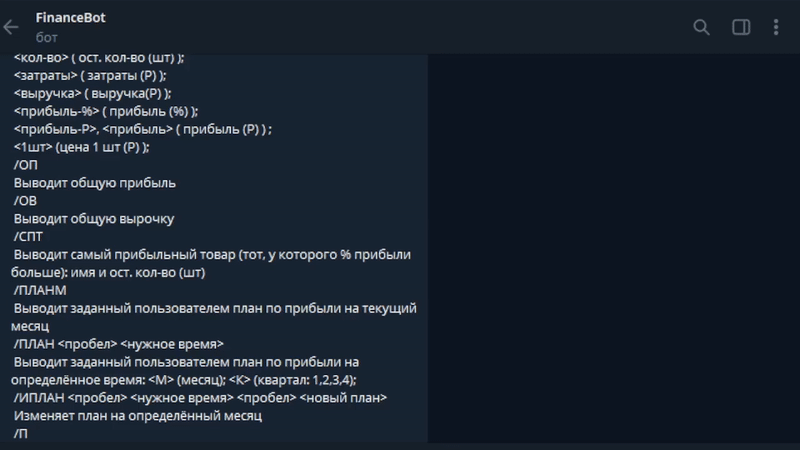

# Отчёты в бинарных форматах

## **Видеопрезентация:**  

## Итоговые отчёты
### Итоговый отчёт Марка
[![Static Badge](https://img.shields.io/badge/Word-_-%233362dd?style=flat&logo=data%3Aimage%2Fsvg%2Bxml%3Butf8%3Bbase64%2CPHN2ZyB4bWxucz0iaHR0cDovL3d3dy53My5vcmcvMjAwMC9zdmciIHdpZHRoPSI0OC4zODMiIGhlaWdodD0iNDcuMjcxIj48ZyBkYXRhLW5hbWU9Im1pY3Jvc29mdCB3b3JkIj48cGF0aCBmaWxsPSIjMmE1Njk5IiBkPSJNMjUuMjg3IDBoMy4yODd2NC40YzUuODgxLjAzMyAxMS43NTctLjA2MSAxNy42MzMuMDMzYTEuODkzIDEuODkzIDAgMCAxIDIuMTIyIDIuMWMuMDkzIDEwLjgyOC0uMDIyIDIxLjY2Mi4wNTUgMzIuNDktLjA1NSAxLjExLjExIDIuMzQyLS41MzMgMy4zMjVhNS4wMDcgNS4wMDcgMCAwIDEtMi43NzYuNTQ0Yy01LjUtLjAyNy0xMS0uMDE2LTE2LjUtLjAxNnY0LjRoLTMuNDM3QzE2Ljc3MyA0NS43NDMgOC4zODUgNDQuMzQxIDAgNDIuODczUS0uMDA2IDIzLjYzOCAwIDQuNDA4QzguNDI4IDIuOTM1IDE2Ljg2MSAxLjUgMjUuMjg3IDBaIiBkYXRhLW5hbWU9IlBhdGggMTQiLz48cGF0aCBmaWxsPSIjZmZmIiBkPSJNMjguNTc2IDYuMDQ2aDE4LjEzNnYzNS4xNzhIMjguNTc2di00LjRoMTQuMjg4di0yLjJIMjguNTc2VjMxLjg4aDE0LjI4OHYtMi4ySDI4LjU3NnYtMi43NDdoMTQuMjg4di0yLjJIMjguNTc2di0yLjc0N2gxNC4yODh2LTIuMkgyOC41NzZ2LTIuNzQ3aDE0LjI4OHYtMi4ySDI4LjU3NnYtMi43NDNoMTQuMjg4di0yLjJIMjguNTc2Wm0tMTcuMjE4IDkuNzEyYzEuMDQ0LS4wNiAyLjA4OS0uMSAzLjEzMy0uMTU5LjczMSAzLjcxIDEuNDc4IDcuNDE1IDIuMjcgMTEuMTA4LjYyMS0zLjgxNSAxLjMwOS03LjYxOCAxLjk3My0xMS40MjcgMS4xLS4wMzggMi4yLS4xIDMuMjkzLS4xNjUtMS4yNDIgNS4zMjYtMi4zMzEgMTAuNy0zLjY4OCAxNS45ODktLjkxOC40NzgtMi4yOTItLjAyMi0zLjM4MS4wNTUtLjczMS0zLjYzOC0xLjU4My03LjI1NS0yLjIzNy0xMC45MS0uNjQzIDMuNTUxLTEuNDc4IDcuMDY5LTIuMjE1IDEwLjZxLTEuNTgzLS4wODItMy4xNzctLjE5M2MtLjkxMi00LjgzNy0xLjk4NC05LjY0MS0yLjgzNi0xNC40ODkuOTQtLjA0NCAxLjg4NS0uMDgzIDIuODI1LS4xMTYuNTY2IDMuNSAxLjIwOSA2Ljk4NiAxLjcgMTAuNDkzLjc3Ni0zLjU5NCAxLjU2Ny03LjE4OSAyLjMzNy0xMC43ODRaIiBkYXRhLW5hbWU9IlBhdGggMTUiLz48L2c%2BPC9zdmc%2B&labelColor=white&color=%233362ad)
](https://github.com/zertmark/practice-2025-1/raw/refs/heads/master/reports/Пашковский%20Марк%20отчёт.docx) 

### Итоговый отчёт Эльдара
[![Static Badge](https://img.shields.io/badge/Word-_-%233362dd?style=flat&logo=data%3Aimage%2Fsvg%2Bxml%3Butf8%3Bbase64%2CPHN2ZyB4bWxucz0iaHR0cDovL3d3dy53My5vcmcvMjAwMC9zdmciIHdpZHRoPSI0OC4zODMiIGhlaWdodD0iNDcuMjcxIj48ZyBkYXRhLW5hbWU9Im1pY3Jvc29mdCB3b3JkIj48cGF0aCBmaWxsPSIjMmE1Njk5IiBkPSJNMjUuMjg3IDBoMy4yODd2NC40YzUuODgxLjAzMyAxMS43NTctLjA2MSAxNy42MzMuMDMzYTEuODkzIDEuODkzIDAgMCAxIDIuMTIyIDIuMWMuMDkzIDEwLjgyOC0uMDIyIDIxLjY2Mi4wNTUgMzIuNDktLjA1NSAxLjExLjExIDIuMzQyLS41MzMgMy4zMjVhNS4wMDcgNS4wMDcgMCAwIDEtMi43NzYuNTQ0Yy01LjUtLjAyNy0xMS0uMDE2LTE2LjUtLjAxNnY0LjRoLTMuNDM3QzE2Ljc3MyA0NS43NDMgOC4zODUgNDQuMzQxIDAgNDIuODczUS0uMDA2IDIzLjYzOCAwIDQuNDA4QzguNDI4IDIuOTM1IDE2Ljg2MSAxLjUgMjUuMjg3IDBaIiBkYXRhLW5hbWU9IlBhdGggMTQiLz48cGF0aCBmaWxsPSIjZmZmIiBkPSJNMjguNTc2IDYuMDQ2aDE4LjEzNnYzNS4xNzhIMjguNTc2di00LjRoMTQuMjg4di0yLjJIMjguNTc2VjMxLjg4aDE0LjI4OHYtMi4ySDI4LjU3NnYtMi43NDdoMTQuMjg4di0yLjJIMjguNTc2di0yLjc0N2gxNC4yODh2LTIuMkgyOC41NzZ2LTIuNzQ3aDE0LjI4OHYtMi4ySDI4LjU3NnYtMi43NDNoMTQuMjg4di0yLjJIMjguNTc2Wm0tMTcuMjE4IDkuNzEyYzEuMDQ0LS4wNiAyLjA4OS0uMSAzLjEzMy0uMTU5LjczMSAzLjcxIDEuNDc4IDcuNDE1IDIuMjcgMTEuMTA4LjYyMS0zLjgxNSAxLjMwOS03LjYxOCAxLjk3My0xMS40MjcgMS4xLS4wMzggMi4yLS4xIDMuMjkzLS4xNjUtMS4yNDIgNS4zMjYtMi4zMzEgMTAuNy0zLjY4OCAxNS45ODktLjkxOC40NzgtMi4yOTItLjAyMi0zLjM4MS4wNTUtLjczMS0zLjYzOC0xLjU4My03LjI1NS0yLjIzNy0xMC45MS0uNjQzIDMuNTUxLTEuNDc4IDcuMDY5LTIuMjE1IDEwLjZxLTEuNTgzLS4wODItMy4xNzctLjE5M2MtLjkxMi00LjgzNy0xLjk4NC05LjY0MS0yLjgzNi0xNC40ODkuOTQtLjA0NCAxLjg4NS0uMDgzIDIuODI1LS4xMTYuNTY2IDMuNSAxLjIwOSA2Ljk4NiAxLjcgMTAuNDkzLjc3Ni0zLjU5NCAxLjU2Ny03LjE4OSAyLjMzNy0xMC43ODRaIiBkYXRhLW5hbWU9IlBhdGggMTUiLz48L2c%2BPC9zdmc%2B&labelColor=white&color=%233362ad)
](https://github.com/zertmark/practice-2025-1/raw/refs/heads/master/reports/Пашковский%20Марк%20отчёт.docx) 